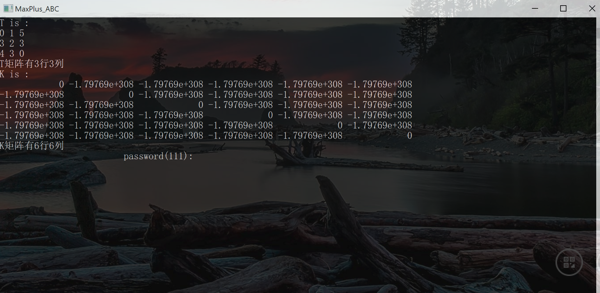

# MaxPlusAlgebra_TK_ABC_MN
MaxPlusAlgebra  Solve "Buffer capacity unlimited serial line problem" By Octave & C/?C++

​	**在精确计算优化目的上，在不同平台生产可执行程序目的上，或者多语言调用的使用目的上，Octave不是一个最佳方案。但是“Octave”是一个实验最佳的开源矩阵实验室，Octave本质是在winGW 用C/C++语言包装的科学计算软件Matlab开源版，为了跨编程语言，跨平台应用，本文还写了Octave算法包等效的“C/C++语言算法包”。**

### [Octave算法包简短说明书](https://v.youku.com/v_show/id_XNDY3NDMwODkxNg==.html)

**如果使用Octave ，直接`pkg install max-plus-ABC.tar.gz`,然后`pkg list` 查看“max-plus-abc”包已经安装，文件浏览安装目录如下：*C:\Octave\OCTAVE~1.0\mingw64\share\octave\packages\max-plus-abc-1.0*也可以查看算法包已经安装成功。**

**然后输入命令“`pkg load max-plus-abc`”即可使用相关算法命令，比如输入`data`可以计算例子test1,输入`task_test`等待“Elapsed time is 2800 seconds.”（大约46.667分钟）可以得到本文相关例子代码。如果想输入自己的T矩阵和K矩阵，不妨直接在自己的工作路径模仿C:\Octave\OCTAVE~1.0\mingw64\share\octave\packages\max-plus-abc-1.0\data.m文件的内容内容进行编辑。**

**不需要使用相关命令，输入“`pkg unload max-plus-abc`”,如果想卸载相关计算包，只需要“`pkg uninstall max-plus-abc`”即可。**

**max-plus-ABC-octave\inst\run-Octave-m.bat**  双击就能运行`data`测试案例，相信聪明的你一看就懂。如果使用*TexMacs*写*Octave*的用户，可以打开这个文件MaxPlus-Algebra-package-introduce-TexMacs.tm，否则就算了，友情提示：Jupyter Notebook写Octave也不错。

### [C/C++语言算法包使用说明](https://v.youku.com/v_show/id_XNDY3NDMxMTk0OA==.html)

  **一开始打算Octave混合编程的，但实际上远没有Matlab开发地方便，源码级别学习，看完Docs是不够的,感兴趣的人请自行阅读：**

**C:\Octave\Octave-1.1.0.0\mingw64\share\doc\octave\octave-tutorial-cn.pdf”**

**如果用户想要想看中文，可以chrome打开liboctave.html自动翻译liboctave.html有相关类对象信息，混合开发用得上,老实说真的不太完善，中文坑不少，相当于二次开发Octave，所以人生苦短，我选Eigen!**

**双击MaxPlus_ABC.exe，选定安装目录，然后卸载只需要删除安装目录相应文件夹，绿色卸载，exe相应演示操作简单易懂，不加赘述，效果图：**

**正常使用相应功能即可：**

 

**相关开发者想修改T矩阵可以在T.txt文件输入需要的矩阵格式，项目中如果需要使用相关算法二次开发请自行查看“MaxPlus_ABC.cpp”。**

**如果不使用VS2019,可以双击“ninja.bat”或者“CMake.bat”,事先说明，windows编程，gcc,Ninja等中文支持不好，坑不少。**

### 二次开发说明

**最简单的使用方法就是源码MaxPlus_ABC.cpp粘贴相关函数定义，如果有必要的话，相关函数声明加上`extern "C" __declspec(dllexport)`编译出dll/lib给其他程序调用即可，就不赘述了。**

**值得提的是，C/C++变成最大的好处是操作系统相关，可以统筹不同的编程语言，比如胶水语言pythoner请自行使用“pybing/SWIG/ctype/…”直接调用C/C++语言程序,或者说js用户可以Emscripten把C/C++需要用的部分代码编译为WASM模块，在网页端使用（main.ll就是MaxPlus_ABC.cpp编译出来的LLVM IR字节码），有需要的用户再整吧，就不再赘述了。**

 

 
